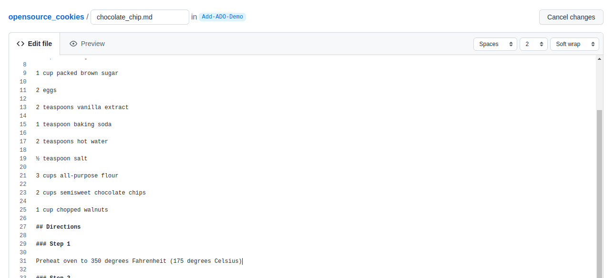

# Inner Source Enablement via Open Source Cookie Recipes (AKA Pull the Other One)

## Purpose of this Exercise

Show how anyone can contribute to an project using cookies recipes as the basis instead of code. This includes:

1. Creating a Issue/Bug/Feature (same process for all 3 just need to choose appropriate one ie. Issue, Bug or Feature)
2. Forking the repository
3. Making a change
4. Creating a Pull Request and associating it with the Issue/Bug/Feature
5. Peer Review
6. Merge into Upstream repository

### Demo Steps (Facilitator should demo each of these in tool of choice ADO, Github, Bitbucket, Gitlab etc)

| Demo Step                    | Description/Definition                                                                                                                                                  |
|------------------------------|-------------------------------------------------------------------------------------------------------------------------------------------------------------------------|
| Create an Issue/Bug/Feature  | This shows that anyone can put in an issue which requires zero development expertise (Example: Recipe only has directions for fahrenheit could you please add celsius?) |
| Fork the Repository          | Makes a copy of the repository in your git namespace so you can make changes without changing the upstream                                                              |
| Make a Change                | Update the recipe to add a feature or fix a bug (in this example we will add Celsius to the cookie recipe)                                                              |
| Create a Pull Request        | Create a pull request to add the change and associate it with the Issue/Bug/Feature in the upstream repository                                                          |
| Peer Review                  | A maintainer of the repository would then approve the change or request fixes before merging code into upstream repository                                              |
| Merge in Upstream Repository | Move code into main branch                                                                                                                                              |

### Activity

Perform at least one of the above tasks as demonstrated in the Demonstration.

| Example Ideas         | Description                                                                                                                                                       |
|-----------------------|-------------------------------------------------------------------------------------------------------------------------------------------------------------------|
| New Issue/Bug/Feature | There is not a gingerbread cookie recipe                                                                                                                          |
| Fork the Repository   | Make a copy of the repository in your git namespace so you can make changes without changing the upstream                                                         |
| Make a Change         | In your fork create nameofcookie.md and put your recipe in it. (change nameofcookie to the name of the cookie you are documenting example: gingerbread.md)        |
| Pull Request          | Put in a Pull Request Request and associate it to the issue you put in previously                                                                                 |
| Peer Review           | Assign Pull Request to a maintainer of the project to review and approve merge into main branch                                                                   |
| Merge                 | Merge Code into main branch once pull request is approved                                                                                                         |

### Example Recipe

Here is a template of a recipe for chocolate chip cookies, feel free to make a copy of this to add another recipe, or to add features to enhance this recipe: [Example Chocolate Chip Cookie Recipe](chocolate_chip.md)

### AzureDevOps Demo Step by step with Screen Shots

1. For AzureDevops you first need to create an Epic before you can create an issue:

    

2. After you have an Epic you can then create a bug/feature/issue:

    

3. Next you can create a fork of the repository by clicking the hamburger menu:

    

4. Now that you have a form you can make edits without changing the main repository (for this example we will add celsius directions):

    

5. Once you are happy with your changes you can put in a request for your changes to be merged into the main branch:

    

    

6. Perform a code review by clicking on the pull requests tab on the left and then files at the top to see what was changed. If you approve you can approve or add suggestions if there are things that need to be changed.

    

7. Click Complete after your merge was approved and it will be accepted into the main branch:

    

### GitHub Demo Step by step with Screen Shots

1. Create an issue: [Source](https://docs.github.com/en/issues/tracking-your-work-with-issues/creating-an-issue)

    a. On GitHub, navigate to the main page of the repository. Under your repository name, click Issues.

    

    b. Click New Issue

    

    c. Choose if this is a bug report, feature request or tracking issue.

    

    d. Create a title and description for your issue/feature/bug
    

2. Next you can create a fork of the repository: ([source](https://docs.github.com/en/get-started/quickstart/fork-a-repo))

    

3. Now that you have a form you can make edits without changing the main repository (for this example we will add celsius directions):

    

4. Once you are happy with your changes you can put in a request for your changes to be merged into the main branch: ([Source](https://docs.github.com/en/github/collaborating-with-pull-requests/proposing-changes-to-your-work-with-pull-requests/creating-a-pull-request))

    a. On GitHub, navigate to the main page of the repository. In the "Branch" menu, choose the branch that contains your commits. ([source](https://docs.github.com/en/github/collaborating-with-pull-requests/reviewing-changes-in-pull-requests/reviewing-proposed-changes-in-a-pull-request))

    

    b. Above the list of files, click Pull request.

    

    c. Use the base branch dropdown menu to select the branch you'd like to merge your changes into, then use the compare branch drop-down menu to choose the topic branch you made your changes in.

    

5. Merging a pull request into the upstream repository branch: ([Source](https://docs.github.com/en/github/collaborating-with-pull-requests/incorporating-changes-from-a-pull-request/merging-a-pull-request))

    a. Under your repository name, click Pull requests.

    

    b. In the "Pull Requests" list, click the pull request you'd like to merge.

    