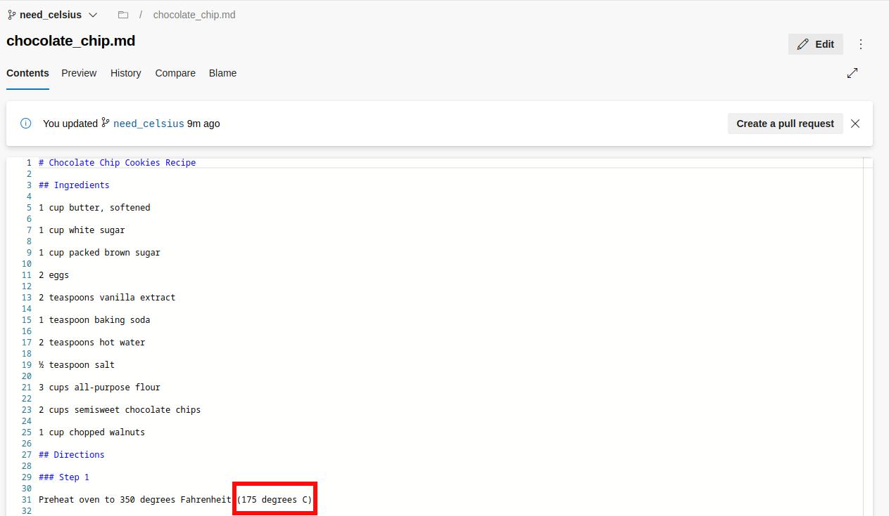
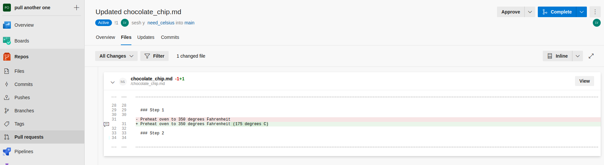
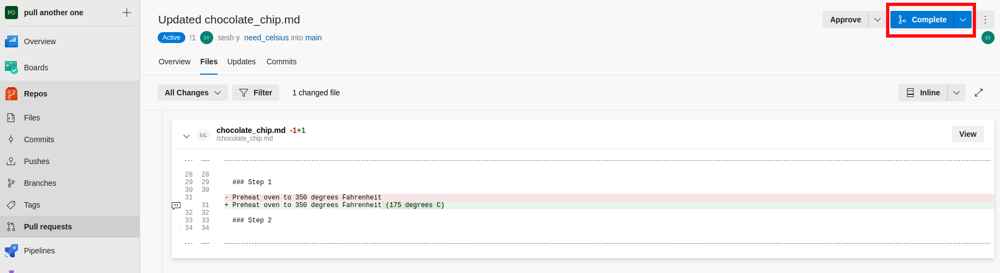

# AzureDevOps Demo

## Create an issue

1. For AzureDevops you first need to create an Epic before you can create an issue:

    

2. After you have an Epic you can then create an issue and assign it to the Epic:

    

3. Next you can create a branch of the repository and assign it to the issue created in previous step:

    

4. Now that you have a branch you can make edits without changing the main branch (for this example we will add celsius directions):

    

5. Once you are happy with your changes you can put in a request for your changes to be merged into the main branch:

    

6. Perform a code review by clicking on the pull requests tab on the left and then files at the top to see what was changed. If you approve you can approve or add suggestions if there are things that need to be changed.

    

7. Click Complete after your merge was approved and it will be accepted into the main branch:

    
